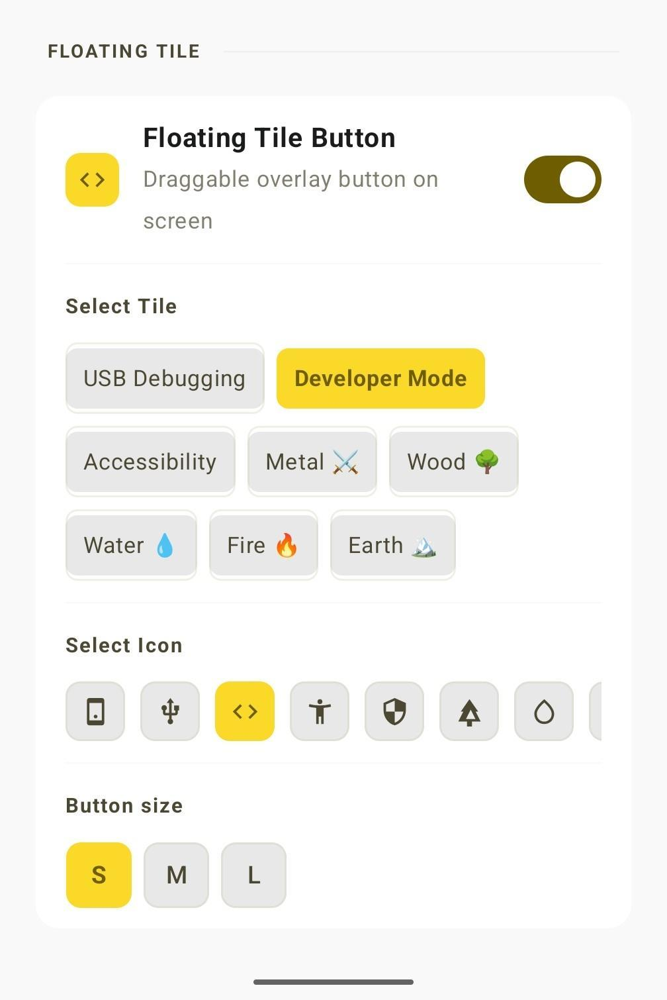
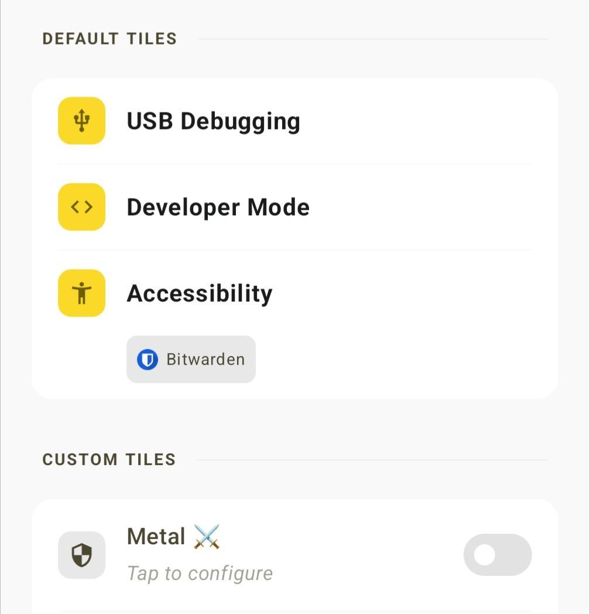

# Release Notes

## v1.0.2 — 2026-03-18

### Download
**[⬇ snap-tiles-v1.0.2.apk](https://github.com/kaidraw-21/android-snap-tiles/raw/main/download/snap-tiles-v1.0.2.apk)**

### What's New

**Floating Tile Button**
- Toggle switch now works correctly (fixed duplicate service conflict)
- Long-press opens the app
- Snap to edge — button animates to nearest left/right edge after drag
- Configurable size: Small (40dp) / Medium (48dp) / Large (56dp)
- Reduced background opacity for less visual intrusion

**Config Card**
- Icon list is now horizontally scrollable (fixes overflow on small screens)
- Fixed border rendering on tile selector chips

### Screenshots

| Floating Button | Snap to Edge | Custom Tiles |
|---|---|---|
|  |  |  |

---

## v1.0.1 — 2026-03-17

### Download
**[⬇ snap-tiles-v1.0.1.apk](https://github.com/kaidraw-21/android-snap-tiles/raw/main/download/snap-tiles-v1.0.1.apk)**

### Improvements
- Optimistic UI update on tile tap — tile state flips instantly without waiting for IO
- Fix: Custom tile actions now toggle correctly when tile contains both parent and child actions (e.g. DEVELOPER_MODE + USB_DEBUGGING in same slot)
- Fix: `toggleAll` no longer double-writes settings when parent/child actions coexist in a tile
- Simplified `setState` logic — removed cascade off/restore children behavior; each action is toggled independently
- `onClick` now reads tile state from `qsTile.state` instead of re-reading ContentResolver
- `targetOn` is passed directly into `toggleAll`, eliminating redundant settings reads
- Home screen custom tile now shows edited label as title and slot name as subtitle (only when label differs)

---

## v1.0.0 — 2026-03-17

### What's New
- Initial release
- Quick Settings tiles: USB Debugging, Developer Mode, Accessibility
- Floating button overlay
- Custom tile slots (up to 5) with Five Elements theme
- Configurable label and actions per slot
- Cache & restore for Accessibility services state
- Cache & restore for USB Debugging state when toggling Developer Mode

### Installation
1. Download `snap-tiles-v1.0.0.apk`
2. Install on device
3. Grant permission via ADB:
   ```
   adb shell pm grant com.snap.tiles android.permission.WRITE_SECURE_SETTINGS
   ```

### Requirements
- Android 8.0+ (API 26)
- ADB access for initial setup

### Known Issues
- None reported
